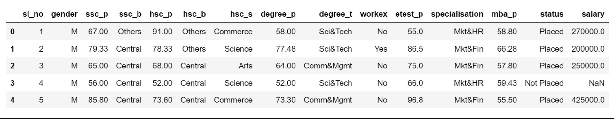
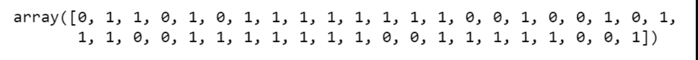
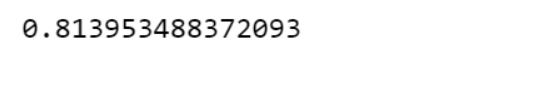
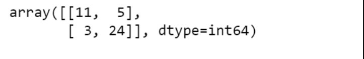
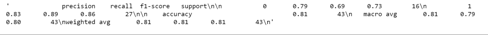

# Implementation-of-Logistic-Regression-Model-to-Predict-the-Placement-Status-of-Student

## AIM:
To write a program to implement the the Logistic Regression Model to Predict the Placement Status of Student.

## Equipments Required:
1. Hardware – PCs
2. Anaconda – Python 3.7 Installation / Moodle-Code Runner

## Algorithm

## step1
Import the standard libraries.
## step2
Upload the dataset and check for any null or duplicated values using .isnull() and .duplicated() function respectively.
## step3
Import LogisticRegression from sklearn and apply the model on the dataset.
## step4
Predict the values of array.
## step5
Calculate the accuracy, confusion and classification report by importing the required modules from sklearn.
## step6
Apply new unknown values.

## Program:
```
~~~
Program to implement the the Logistic Regression Model to Predict the Placement Status of Student.
Developed by: P.Ramsai
RegisterNumber: 212221240041
~~~
import pandas as pd
data=pd.read_csv("Placement_Data.csv")
data.head()

data1=data.copy()
data1=data1.drop(["sl_no","salary"],axis=1)
data1.head()

data1.isnull().sum()
data1.duplicated().sum()

from sklearn.preprocessing import LabelEncoder
le=LabelEncoder()
data1["gender"]=le.fit_transform(data1["gender"])
data1["ssc_b"]=le.fit_transform(data1["ssc_b"])
data1["hsc_b"]=le.fit_transform(data1["hsc_b"])
data1["hsc_s"]=le.fit_transform(data1["hsc_s"])
data1["degree_t"]=le.fit_transform(data1["degree_t"])
data1["workex"]=le.fit_transform(data1["workex"])
data1["specialisation"]=le.fit_transform(data1["specialisation"])
data1["status"]=le.fit_transform(data1["status"])
data1
x=data1.iloc[:,:-1]
x
y=data1["status"]
from sklearn.model_selection import train_test_split
x_train,x_test,y_train,y_test=train_test_split(x,y,test_size=0.2,random_state=0)

from sklearn.linear_model import LogisticRegression
lr=LogisticRegression(solver="liblinear")
lr.fit(x_train,y_train)
y_pred=lr.predict(x_test)
y_pred
from sklearn.metrics import accuracy_score
accuracy=accuracy_score(y_test,y_pred)
accuracy

from sklearn.metrics import confusion_matrix
confusion=confusion_matrix(y_test,y_pred)
confusion

from sklearn.metrics import classification_report
classification_report1=classification_report(y_test,y_pred)
classification_report1
lr.predict([[1,80,1,90,1,1,90,1,0,85,1,85]])

```
## Output:
## HEAD OF THE DATA:

## PREDICTED VALUES:

## ACCURACY:

## CONFUSION MATRIX:

## CLASSIFICATION REPORT:



## Result:
Thus the program to implement the the Logistic Regression Model to Predict the Placement Status of Student is written and verified using python programming.
